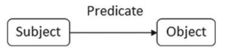
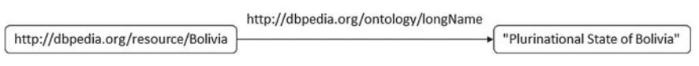
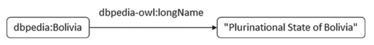
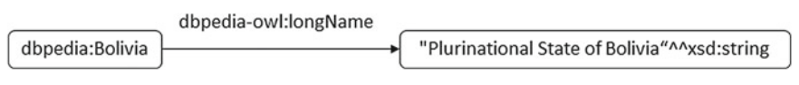
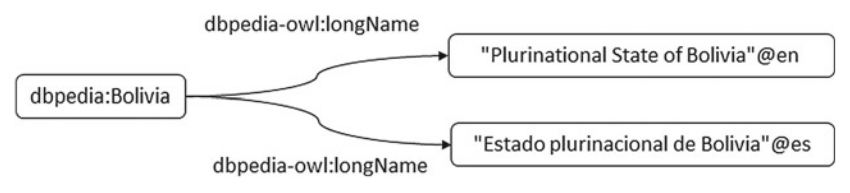
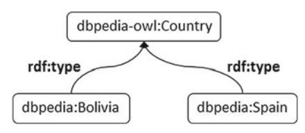
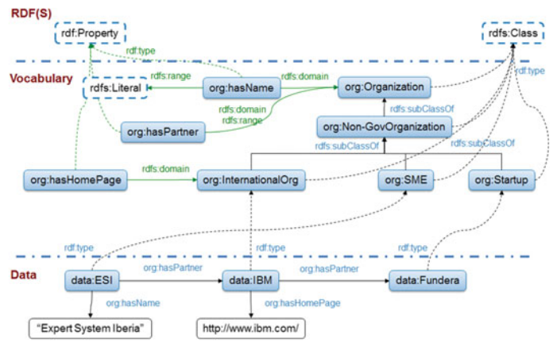

# 2.1 知识表示和查询语言

知识表示和推理（Knowledge Representation and Reasoning, KR）是人工智能（Artificial intelligence, AI）的一个领域，致力于以表单形式表示信息，以便计算机进行相关信息的自动推理，从而解决诸如决策支持之类的复杂任务。如第一章所述，知识图谱可以看作是KR的一些现代变体，称为语义网络。

知识图谱是一组具有类型的实体（具有属性），它们通过关系相互关联。这些实体和关系的类型在称为本体的模式层中定义。这种定义的类型称为术语。在本节中，我们将介绍用于表示知识图谱的标准（RDF）、用于定义本体层的两个标准（RDFS和OWL）以及用于知识图谱查询的标准。请注意，这些标准不会影响人们使用某些自定义序列来构建企业知识图谱。

## 2.1.1 RDF and RDFS

在这一节，我们将介绍RDF（Resource Description Framework）和RDFS（RDF Schema）。正如1.1节所提到的，RDF是语义网络的现代标准。RDFS则是RDF知识图谱的简单模式语言。在2.1.2节，我们将介绍另外一个标准OWL，它为知识图谱提供了更全面的模式语言系列。

### RDF

RDF是W3C（World Wide Web Consortium，W3C）推荐使用的标准，用来描述实体，其中，实体通常被视为W3C中的资源。资源可以是我们可以识别的任何东西，例如人物，主页或“权力的游戏”中的巨龙。在本节中，我们将使用[纽约时报链接数据集](http://datahub.io/dataset/nytimes-linked-open-data)和[DBpedia](http://dbpedia.org/About)中的一些组织示例进行说明。

#### RDF三元组和图

资源在RDF三元组中描述，RDF三元组又称为语句，拥有以下谓词-值对。RDF三元组中的值也可以为资源（图2.1）。
> [subject preicate object .]

RDF图由一组RDF三元组组成，表现为节点定向弧图，其中每个三元组由节点-弧-节点链路标书。在RDF图中有三种节点：国际化资源标识符（Internationalised Resource Identifiers），或IRIs，字面量和空白节点[61]。更准确地说，在一个RDF三元组中，

- 主体可以是IRI或者空节点；
- 谓词应为IRI；
- 客体可以是IRI，字面量或者空节点。

在RDF图中，IRI是一个单独标识资源的字符串[71]。IRIs是统一资源标识符（Uniform Resource Identifiers, URIs）[27]的概括，它允许更广泛的字符。
字面量用于描述诸如字符串，数字和日期之类的值。 RDF图中的字面量由两个或三个元素组成：

- 词汇格式，这是一个Unicode字符串，应该是普通形式C[65]；
- 数据类型IRI，即标识确定词汇格式如何组成字面量的数据类型的IRI；
- 非空语言标记，如果数据类型IRI为http://www.w3.org/1999/02/22-rdf-syntax-ns#langString ，则根据[189]的定义标记为非空语言标记。

空节点既不属于IRI，也不属于字面量，并且可能出现的空节点集是没有规律的。RDF不涉及任何空节点的内部结构。空节点是RDF图中节点的一种，表示未给出IRI或字面量的资源。由空节点表示的资源也称为匿名资源。空节点简单地指示事物的存在，而不使用IRI来标识任何特定事物，具有以下功能：

- 描述多组件结构，如RDF容器;
- 描述具体化，即出处信息;
- 表示复杂属性，而无需明确命名辅助节点，例如：由街道，号码，邮政编码和城市组成的地址;
- 保护内部信息，例如，保护客户的敏感信息免受浏览器的侵害。

图2.2展示了只有一个三元组的RDF图，其中主体为http://dbpedia.org/resource/Bolivia ，谓词为http://dbpedia.org/ontology/longName ，客体为字面量“Plurinational State of Bolivia”。这个三元组表达的意思为，Bolivia的长名为Plurinational State of Bolivia。

IRI通常以被称为命名空间IRI的公共子字符串开头。根据约定，一些命名空间IRI与被称为命名空间前缀的短名称相关联。前缀可以声明如下。

    prefix dbpedia: http://dbpedia.org/resource/
    prefix dbpedia-owl: http://dbpedia.org/ontology/
    prefix xsd: http://www.w3.org/2001/XMLSchema#

图2.3展示了在之前的RDF图（图2.2）中使用已声明的前缀的结果。

此外，我们还可以修改图形并加入字面量的类型，见图2.4。

最后，我们还可以在字面量中包含语言描述，如图2.5所示。

与在1.1中所提到的传统语义网络不同，RDF具有一些语言级预定义属性。这里我们将介绍rdf:type，而另一种类型将在本节后面介绍RDF模式时进行解释。rdf:type属性是用于资源分类的，是语义网络中的is-a关系。图2.6描述了使用rdf:type的一个例子。

#### 序列化RDF

RDF为知识图谱提供了标准的数据模型。目前有几种用于存储和交换RDF的序列化语法，例如Turtle[190]，RDF/XML[3]，RDFa[4]，N-Triples[2]，NQUADS[1]和JSON-LD[220]。

一个Turtle文档允许以紧凑的文本形式序列化RDF。其可以在不属于另一个词法标记的＃之后给出注释，而IRI应该包含在<>中。

    prefix foaf: <http://xmlns.com/foaf/0.1/> #这是朋友的朋友的前缀（foaf）声明。

以下是一些字面量的例子，包括多于一行的长字面量

    "Literal"
    "Literal"@language
    """Long Literal with
    multiple lines"""

这些是数据类型字面量的示例，由“词汇格式”^^数据类型URI组成。

    "10"^^xsd:integer
    "2006-09-04"^^xsd:date

接下来，我们提供三元组和缩写的一些示例。其中三元组以“.”结束，如下所示。

    lab:aleix foaf:knows lab:nuria.
    lab:aleix foaf:knows lab:almu.

我们可以使用“,”来分隔上述例子中具有相同主体和谓词的三元组的不同值，如下所示。

    lab:aleix foaf:knows lab:nuria , lab:almu.

类似的，我们可以使用“;”来分隔具有相同主体的三元组的不同谓词-值对，例如将以下两个三元组

    lab:aleix foaf:nickname "paco".
    lab:aleix foaf:currentProject lab:K-Drive.

转换成：

    lab:aleix foaf:nickname "paco" ; foaf:currentProject lab:K-Drive.

介绍完所有基础知识后，让我们看一下前面提到的一些RDF图。例如，图2.3展示的RDF图可以在Turtle中序列化：

    @prefix dbpedia: <http://dpedia.org/resource/>
    @prefix dbpedia-owl: <http://dbpedia.org/ontology/>

    dbpedia:Bolivia dbpedia-owl:longName "Plurinational State of Bolivia" .
 
而图2.5展示的RDF图则可以在Turtle中序列化为：

    @prefix dbpedia: <http://dpedia.org/resource/>
    @prefix dbpedia-owl: <http://dbpedia.org/ontology/>

    dbpedia:Bolivia dbpedia-owl:longName "Plurinational State of Bolivia"@en .
    dbpedia:Bolivia dbpedia-owl:longName "Plurinational State of Bolivia"@es .

### RDFS

RDFS为RDF提供了一种简单的模式语言，并允许使用预定义的语言级别rdfs:Class或rdfs:Property来声明类或属性。在以下示例中，org:Organization为一个类的声明，而org:hasHomePage为一个属性的声明：

    org:Organization rdf:type rdfs:Class.
    org:Start-up a rdfs:Class. # 我们也可以使用“rdf:type”的缩写“a”来代替“rdf:type”
    org:hasHomePage rdf:type rdfs:Property.

此外，RDFS还可以使用预定义的语言级属性在类和属性之间指定一些依赖关系，例如rdfs:subClassOf，rdfs:subPropertyOf，rdfs:domain，rdfs:range。

- [C1 rdfs:subClassOf C2.]表示C1是C2的一个子类，则所有C1的实例同时也是C2的实例，下述例子表达了org:Start-up是org:Non-GovOrganization的一个子类：

        org:Start-up rdfs:subClassOf org:Organization.

- [P1 rdfs:subPropertyOf P2.]表示P1是P2的一个子属性，则所有P1的实例同时也是P2的实例，下述例子表达了org:hasEnglishHomePage是org:hasHomePage的一个子属性：

        org:hasEnglishHomePage rdfs:subPropertyOf org:hasHomePage.

- [P rdfs:domain C.]表示属性P的定义域是C，则所有拥有属性P的资源都是类C的实例，下述例子表达了所有拥有属性org:hasPersonalHomePage的资源都是org:Organization的一个子类：

        org:hasHomePage rdfs:domain org:Organization.

- [P rdfs:range E.]表示属性P的值域是C，则属性P的值都是E的实例，其中E可以使一个类或者数据类型（例如rdfs:Literal），下述例子表达了org:hasHomePage的值域是rdfs:Literal：

        org:hasHomePage rdfs:range org:Literal.

图2.7中RDF图使用Turtle序列化后，得到：

    @prefix org: <http://www.w3.org/ns/org#>
    @prefix rdf: <http://www.w3.org/1999/02/22-rdf-syntax-ns#>
    @prefix rdfs: <http://www.w3.org/2000/01/ref-schema#>
    @prefix data: <http://data.lab.expertsystem.com>

    org:Organization a rdfs:Class.

    org:Non-GovOrganization a rdfs:Class ; rdfs:subClassOf org:Organization.

    org:InternationalOrg a rdfs:Class ; rdfs:subClassof org:Non-GovOrganization.

    org:SME a rdfs:Class ; rdfs:subClassof org:Non-GovOrganization.

    org:Startup a rdfs:Class ; rdfs:subClassof org:Non-GovOrganization.

    org:hasName a rdfs:Property ; rdfs:domain org:Organization ; rdfs:range rdfs:Literal.

    org:hasPartner a rdfs:Property ; rdfs:domain org:Organization ; rdfs:range org:Organization.

    org:hasHomePage a rdfs:Property ; rdfs:domain org:InternationalOrg.

    data:ESI a org:SME ; org:hasPartner data:IBM ; org:hasName "Expert System Iberia".

    data:IBM a org:InternationalOrg ; org:hasPartner data:Fundera ; org:hasHomePage "http://www.ibm.com".

    data:Fundera a org:Startup.

应该注意的是，RDFS作为模式语言,仅提供有限的表达能力。它的局限性如下：

1. 它不支持否定。例如，我们可以用RDF表达data:ESI是org:SME，但不可以表达data:ESI不是一个人。
2. 它不提供构造函数来定义类。例如，我们无法使用RDFS定义什么是org:SME。
3. 尽管它提供了模式级别的对齐（使用rdfs:subClassOf和rdfs:subPropertyOf），但它不支持实例级别的对齐。例如，无法使用其表达data:ESI和db:ESI其实是一样的。

我们将通过使用更全面的模式语言OWL来解决上述限制，这将在下一节中介绍。

## 2.1.2 OWL

不同于作为知识图谱/语义网络的现代标准的RDF，标准本体语言OWL是以一系列称为描述逻辑（Description Logics, DLs）的形式知识表示[16]作为基础的。第一个DL称为KL-One，拥有比语义网络更强大的表达能力，同时保持可判定性。W3C推荐使用OWL的最新版本OWL 2[187]作为Web本体的事实标准。OWL本体的推理服务可用于检查知识图谱的逻辑和语义不一致性，同时也支持查询和问答，这部分我们将在本书后面讨论。

从语法上讲，OWL可以被视为RDFS的扩展，具有由OWL模式预定义的[附加词汇表](http://www.w3.org/2002/07/owl)。这种模式词汇​​表为人们构建本体以及注释其数据提供了广泛的强大表达能力，例如合格的基数限制，属性链，自限制，对称，以及反身属性。接下来，我们将展示[Travel本体](http://swatproject.org/travelOntology.asp)中的一些例子，以说明OWL 2的表达能力。

    :borders rdf:type owl:ObjectProperty , owl:SymmetricProperty ;
             rdfs:domain :AdministrativeDivision ; 
             rdfs:range :AdministrativeDivision ;
             owl:propertyChainAxiom ( :hasBoundary
                                      :boundaryOf
                                    ).

上述例子说明了：在Travel本体中，在两个AdministrativeDivision实例之间指定了一个名为*boarders*的对象属性。而这个属性有一些无法在RDF（S）中表达的有趣的特征：

1. 这个属性拥有类型owl:SymmetricProperty，这意味着如果实体a的边界为另外一个实体b，则实体b的边界也为实体a。
2. 该属性具有owl：propertyChainAxiom，其中包含另外两个属性hasBoundary和boundaryOf。这意味着，如果a具有边界b，并且b是c的边界，那么a拥有边界c。

以下是描述类的文件中的另外一个片段：

    :SuperContinent rdf:type owl:Class ;
        owl:equivalentClass [rdf:type owl:Class ;
            owl:intersectionOf ( :Island
                [ rdf:type owl:Restriction ;
                  owl:onProperty :hasDirectPart ;
                  owl:onClass :Continent;
                  owl:minQualifiedCardinality "2"^^xsd:nonNegativeInteger
                ]
            )
        ] .

这里定义了*SuperContinent*类，这个类拥有以下有趣的特征：

1. 它由owl：equivalentClass属性定义，这意味着SuperContinent类的任何实例都应满足其等效类属性所包含的描述，并且满足此类描述的任何内容都是SuperContinent的实例。
2. 定义SuperContinent的描述类型为owl：intersectionOf，这意味着这个描述是另外两个描述的结合，如代码所示，其中一个是Island，另一个是owl：Restriction的一个实例。
3. 为owl：Restriction定义了属性hasDirectPart，类Continent及基数≥2。这意味着此限制的实例应该与至少两个不同的Continent实例具有hasDirectPart关系。

总的来说，它定义了一个超大陆相当于一个岛屿，该岛屿至少由两片不同的大陆组成，反之亦然。

在上面的示例中，OWL注释提供了可用于发现隐藏信息的语义。例如，根据两个对象之间的hasBoundary关系和boundaryOf关系链，我们可以使用OWL推断出隐藏的边界关系。然而，由于OWL 2提供的强大的表达能力，如果不限制OWL 2模式词汇的使用，这种推断不一定能在有限的时间内执行完毕。而我们可以使用计算可判定逻辑的相关语法来编写OWL 2文件来打破这种限制。

因此，我们引入OWL 2 DL语法，其中DL代表描述逻辑。描述逻辑（Description Logic, DL）[16]是一系列使用概念（一元谓词），角色（二元谓词）及其实例来描述话语领域的形式知识表示。DL在不同的领域有不同的表达，在如何构造和使用谓词方面彼此不同。例如，在作为迄今为止最具表现力和可判断性的DL之一的\mathcal{SROIQ}中，概念表达式可归纳为原子概念A，单例定义\{a\}，上界\top，下界\bot，否定\neg{C}，交集C \sqcap D，存在性约束\exists R.C，局部反身性\exists S.Self或至少性约束\geq{n} S.C，其中A为概念，a为个体名，C、D均为概念表达式，而R、S为角色表达式[120]，可以是原子角色r或反向角色r^-。根据指定的概念和角色，我们可以使用公理来组织领域知识，例如概念包含关系C \sqsubseteq D，角色链R_1 \circ R_2 \sqsubseteq R_3，类断言a:C和角色断言( a, b ):R。这样的DL公理的集合被称为DL的本体。在DL本体中，概念和角色公理的集合称为*TBox*，而断言的集合称为*ABox*。

OWL 2 DL由\mathcal{SROIQ}提供支持。如果一个OWL 2文件遵守OWL 2 DL语法时，它就可以被视为\mathcal{SROIQ}本体的语法变体，其中类对应于概念，属性对应于角色。例如，示例1中的*borders*的特征可以重写为以下DL公理：

Domain Restriction: \exists borders.\top \sqsubseteq AdministrativeDivision

Range Restriction:  \exists borders^-.\top \sqsubseteq AdministrativeDivision

Role Chain:     hasBoundary \circ boundaryOf \sqsubseteq borders

而在示例1中定义的*SuperContinent*可以重写为以下DL公理：

SuperContinent \equiv Island \sqcap \geq{2} hasDirectPart.Continent

而所有不遵守OWL 2 DL语法约束的OWL 2本体都被认为是OWL 2 Full本体。

\mathcal{SROIQ}的逻辑根也提供了解释OWL 2 DL文件的形式语义。假设\Delta为定义域，\centerdot ^{\mathcal{I}}为解释函数，则个体a被解释成定义域中的一个实体a^{\mathcal{I}} \subseteq \Delta，概念（类）C被解释成集合C^{\mathcal{I}} \subseteq \Delta,而角色（属性）R被解释成集合R^{\mathcal{I}}\subseteq \Delta \times \Delta。也可以使用通过形式语义解释公理。例如，上述公理中的SuperContinent^{\mathcal{I}}等同于以下解释：

Island^{\mathcal{I}} \cap \{x|\#\{y|y \in Continent^{\mathcal{I}},(x,y) \in hasDirectPart^{\mathcal{I}}\} \geq{2}\}

换句话说，*SuperContinent*是一个属于*Island*域的实体集，每个域实体与属于*Continent*的至少两个不同的实体之间具有hasDirectPart关系。有兴趣的读者可以阅读[120]，了解更多有关\mathcal{SROIQ}的语法和语义的详细信息。这种基于\mathcal{SROIQ}的语义也称为OWL 2的直接语义，另一方面，OWL 2的Full本体只能用基于RDF的语义来解释。

自动化推理机可以根据形式语义和可判断逻辑基础进行本体推理。在本体中，典型的推理服务如表2.1所示。

| 推理服务 | 描述 |
|-----|--------|
|本体一致性检查|检查一个本体是否存在矛盾|
|分类|计算类之间可推断的OWL:subClassOf关系|
|实例化|计算个体和类之间的可推断的RDF:type关系|
|类的可满足性检查|检查一个类能否拥有一个实例|
|公理蕴含性检查|检查是否可以从本体推导出公理|
|联合查询回答|针对本体的查询进行回答|

这些推理服务已由众多的推理机实施，如FaCT++[233]，Pellet[216]，HermiT[213]，TrOWL[231]和Knoclude[221]。

尽管OWL 2 DL在计算上是可判定的，但使用它来进行推理仍然相当复杂。为了解决这个问题，OWL 2的设计者进一步限制其语法，发布了三个OWL 2配置文件，目前除了联合查询回答之外，大多数推理服务可以在多项式时间内执行。这些配置文件如下：

1. **OWL 2 EL**是一个提供了大型术语的有效分类的OWL 2配置文件。它基于DLs的\mathcal{EL}系列，并具有表达能力，如类交叉（owl：intersectionOf），合理的存在性约束（owl：someValuesFrom）和属性链（owl：propertyChainAxiom）。目前，OWL 2 EL已被广泛用于许多大型的本体，例如，SNOMED CT本体 [219]。
2. **OWL 2 QL**是一个可以大量数据提供高效的查询应答服务OWL 2配置文件。它基于DLs的DL-Lite系列，并具有表达能力，如反向属性（owl：inverseOf）。值得注意的是，OWL 2 QL本体的联合查询回答可以简化为关系数据库中的SQL查询，使其也可以享受关系型数据库开发的系统和优化。同时，由于这种与关系数据库的关系，OWL 2 QL成为传统数据库数据的语义升级和基于本体的数据访问的理想候选者。
3. **OWL 2 RL**是一个受描述逻辑程序启发的OWL 2配置文件。它支持功能性特征（owl：FunctionalProperty），并且可以使用基于规则的推理引擎实现其推理机制，因此，适用于具有演绎数据库和Datalog引擎的场景。例如，[Oracle Spatial and Graph Database](http://www.oracle.com/technetwork/database/options/spatialandgraph/overview/index.html)的内部实现了OWL 2 RL推理机。

OWL 2 Web本体语言（OWL 2）[171]是具有形式语义的语义网络的最先进的本体语言，也是当前W3C推荐使用的标准。OWL 2是最着名的本体语言OWL的扩展，旨在通过引入新的结构来扩展OWL规范的表现力。

本节仅介绍OWL 2的简要介绍。感兴趣的读者，可以阅读[OWL 2概述](http://www.w3.org/TR/owl2-overview/)。