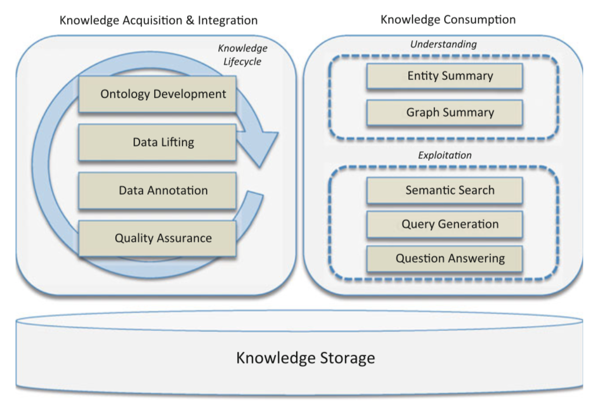

# 3.1 体系结构概览

从广义上讲，与知识图谱的应用相关的主要任务有三个：构建，存储和消费。这些任务是图3.1中描述的ARA的主要层次。

**知识获取和集成层** 首先，你需要构建知识图谱。自底向上构建知识图谱，是借助你自己已拥有的数据，根据其中的实体和关系提取知识；而自顶向下构建是通过分析已有的各种用例并定义需要从数据中获取的知识；自中向外构建，结合了自顶向下和自底向上方法。此任务对应于体系结构中的知识获取和集成层（本书第四和第五章）

**知识存储层** 其次，你需要存储知识图谱，并且随着时间推移（例如：添加新的知识类型）能够不断演化图谱并以有效的方式访问图谱中编码的知识。此任务对应于体系结构中的知识存储层。

**知识消费层** 最后，你需要将编码在知识图谱中的知识应用于你的组织，以提高组织的效率。此任务对应于体系结构中的知识消费层。（本书第六和第七章）

抽象体系结构中的每个层都可以包含许多子任务,这些子任务可以使用不同的方式和不同的技术来执行。本书中的其余章节将详细介绍特定的子任务;因此，在本章中，我们将重点介绍一般方法并给出一些简短的示例用于说明如何执行这些任务。 

在3.2节中，我们讨论知识获取和集成的各种子任务。我们将首先指出管理知识图谱生命周期的各种方法，即决定何时执行某些子任务以及完成的程度：从分析数据（当使用自底向上的方法）或用例域（自顶向下），通过建模域数据并生成数据，直至发布和应用知识图谱。正如我们将要看到的，如何做到这一点有各种各样的选择; 哪一个是最好的将取决于你的组织：拥有哪些数据，数据已经互相连接的程度以及预期用途。

在3.2.1节中我们还将详细介绍知识图谱的各种建模方法，即正式定义你将在知识图谱中包含（或已经存在）的所有实体类型。对域进行此类正式定义对于自动解释知识图谱中的数据非常有用。正如我们稍后将看到的，拥有丰富的域描述可以被各种算法用于检测不一致或在文本注释期间执行消歧。正式定义也可能是有害的，因为它们可能过度限制数据：~~例如，当不是错误的数据检测不一致性时，而是考虑一些有效用例不够灵活的模式。~~

知识图谱构建中一个主要的子任务是复用组织中现有的结构化数据和模式。在3.2.2节中我们介绍了各种转换现有资源（如关系型数据库（及其模式），叙词表或结构化文件）的方法。

对于非结构化文档（例如办公文档，电子邮件），方法是不同的。因为你经常需要使用自然语言处理的方法才能够将这些文档链接到你的知识图谱中。在3.2.3节中我们介绍了如何做到这一点，并指出各种系统如何执行此任务。

为了总结我们关于知识获取的讨论，我们还将提到如何从你现有数据中学习部分域定义。这称为本体学习，将在3.2.4节中讨论。

关于知识存储所需的子任务，存储知识图谱的标准方法是使用图数据库。但是，我们将首先讨论如何通过添加转换层来避免重复存储已经存储在其他形式（例如关系型数据库）中的数据，以便使用知识图谱定义的概念层访问这些数据源。这意味着你可以向你的知识图谱中询问X类型的实体，并且可以从现有的关系型数据库中检索这些实体。这种方法的缺点是在图数据库中可以执行的一些自动推理不能有效地由转换层执行。关于这种方法的更多内容将在3.3.1节中讨论。

正如我们所说，存储知识图谱的典型方法是使用图数据库。在3.3.2节中我们将介绍一种基于Web和关联数据技术构建的图数据库的标准化版本，称为RDF Stores。这些数据库是在过去十年中密集开发的，因此我们可以借鉴文献（和我们自己）中关于使用此类数据库构建的系统的大量报告经验。我们介绍了各种可用的RDF存储，并讨论了如何在不同维度上评估这些RDF存储。最后，在3.3.3节我们还将分析一种不同的图数据库方法，这种方法没有标准化，并讨论它与RDF存储的比较。

对于最后一层架构，从知识图谱中消费知识，在3.4节中我们将介绍知识图谱的各种典型用法：语义搜索（即改进当前的搜索界面），通过实体和图谱摘要向你的员工或客户提供上下文，以便回答与你的组织相关的问题。